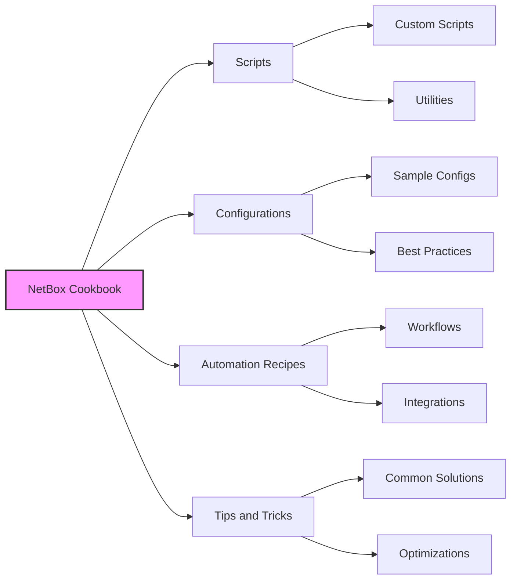

# NSoT (network source of truth) [Netbox] Cookbook


Welcome to the NetBox Cookbook repository! This is a community-driven collection of handy examples, scripts, and recipes to help users get started with NetBox and share ideas on how to make the most of it.

> ⚠️ **Important Notice**: Some content in this repository is AI-generated or AI-assisted. While we strive for accuracy, all scripts and configurations should be carefully reviewed before use in production environments.

## About NetBox

NetBox is a powerful tool for network automation, providing IP address management (IPAM) and data center infrastructure management (DCIM). However, getting started or optimizing its usage can sometimes be challenging. This repository aims to make that journey easier by sharing practical, ready-to-use examples.

## What's in the Cookbook?



Here you will find:

- **Scripts**: Useful scripts to extend NetBox functionality
- **Configurations**: Sample configuration files and settings to get NetBox up and running quickly
- **Automation Recipes**: Step-by-step guides and best practices for integrating NetBox into your automation workflows
- **Tips and Tricks**: Handy solutions to common problems, and ways to improve efficiency when using NetBox

## ⚠️ Security Notice

Before using any scripts or configurations from this repository:
- Review all code thoroughly before running in your environment
- Test in a non-production environment first
- Verify compatibility with your NetBox version
- Check for potential security implications
- Ensure you understand what each script does

## Getting Started

To use this cookbook:

1. Clone this repository to your local machine:
```bash
git clone https://github.com/steinzi/netboxcookbook.git
```

2. Browse the folders to find recipes that fit your needs. Each folder contains a README.md that explains how to use the examples.

3. Customize the scripts and examples as needed for your own environment.

## Version Compatibility

- Each recipe includes information about compatible NetBox versions
- Always check compatibility before implementation
- Some scripts may need modification for different versions

## Contributing

We'd love for you to contribute to the NetBox Cookbook! If you have a useful script, guide, or any kind of NetBox-related material that could help others, please consider sharing it here.

### How to Contribute

1. Fork this repository
2. Create a branch with your new recipe or improvement
3. Add appropriate documentation and version compatibility information
4. Include any relevant warnings or prerequisites
5. Open a pull request with a clear description of what your contribution includes

> 📝 **Note**: Please indicate if your contribution contains AI-generated content

### Contribution Guidelines

- Clear documentation is required
- Include example outputs where applicable
- Add appropriate warning labels for potentially dangerous operations
- Test your contributions thoroughly
- Include information about tested NetBox versions

## License

you do you fam.

## Community and Support

- **Issues**: Use GitHub Issues for bugs and feature requests
- **Discussions**: Join our GitHub Discussions for general questions
- **Security**: Report security concerns privately to maintainers

## Acknowledgments

- NetBox Community
- All contributors
- Includes AI-assisted content from various sources

## Disclaimer

This is a community project and not officially associated with NetBox. Use all content at your own risk and always verify compatibility with your environment.

---

Happy automating! 🚀
