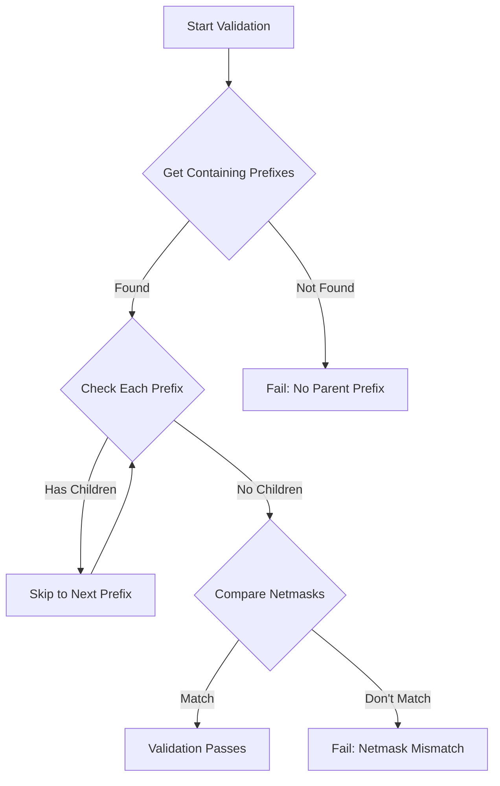
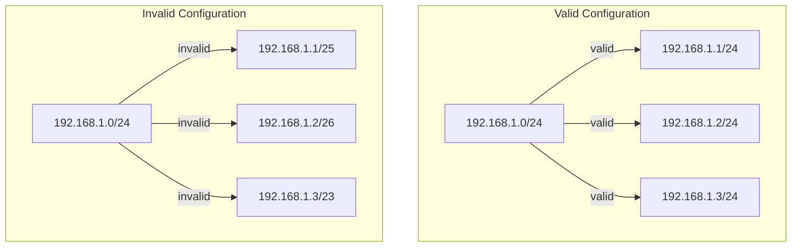

# ip-mask-matches-parent-prefix
(Not tested yet)
For more information, refer to the [NetBox Custom Validation Documentation](https://netboxlabs.com/docs/netbox/en/stable/customization/custom-validation/).


So this is when you need to make sure that people that are assigning IP addresses to devices are doing so in a way that is consistent with the network's addressing scheme.

In this case it's about not allowing people to save IP addresses that don't match the parrentprefix mask of the network.

This is a pretty common thing to want to do, and it's a good idea to make sure that people are doing this correctly.

# Netbox IP Address Netmask Validator

## Overview
This custom validator for Netbox ensures that IP addresses have netmasks matching their parent prefix's netmask. This helps maintain network hierarchy consistency and prevents configuration errors where IP addresses might have inappropriate subnet masks for their parent networks.

## Validation Flow


## Network Structure Examples


## Use Case
When adding IP addresses to Netbox, it's important that their netmasks align with the prefix they belong to. For example:
- If you have a prefix `192.168.1.0/24`, all IP addresses within this prefix should use `/24` as their netmask
- An IP address like `192.168.1.10/25` would be invalid within a `/24` prefix

This validator automatically enforces this rule during IP address creation and modification.

## Installation

1. Create a new Python file (e.g., `ip_netmask_validator.py`) in your Netbox custom validators directory:
```python
/opt/netbox/netbox/custom_validators/ip_netmask_validator.py
```

2. Copy the validator code into this file.

3. Add the validator to your Netbox configuration. In `configuration.py`:
```python
CUSTOM_VALIDATORS = {
    'ipam.ipaddress': [
        'custom_validators.ip_netmask_validator.IpAddressNetmaskMatchesPrefixNetmask'
    ]
}
```

## How It Works

The validator performs the following checks:
1. Finds all prefixes containing the IP address (considering VRF context)
2. Identifies the most specific parent prefix without children
3. Compares the IP address netmask with the parent prefix's netmask
4. Raises a validation error if the netmasks don't match

### Example Scenarios

#### Valid Configuration:
```
Prefix: 192.168.1.0/24
├── IP: 192.168.1.1/24 ✓ (valid)
├── IP: 192.168.1.2/24 ✓ (valid)
└── IP: 192.168.1.3/24 ✓ (valid)
```

#### Invalid Configuration:
```
Prefix: 192.168.1.0/24
├── IP: 192.168.1.1/25 ✗ (invalid - netmask doesn't match)
├── IP: 192.168.1.2/26 ✗ (invalid - netmask doesn't match)
└── IP: 192.168.1.3/23 ✗ (invalid - netmask doesn't match)
```

## Error Messages

The validator provides two types of error messages:

1. Netmask mismatch:
```
IP address netmask (/25) must match its parent prefix's netmask (/24).
```

2. No parent prefix:
```
No valid parent prefix found for this IP address.
```

## Dependencies
- Netbox 3.0+
- Django 3.2+

## Troubleshooting

If you encounter issues:

1. Check that the validator is properly registered in your `configuration.py`
2. Verify that the parent prefix exists and doesn't have child prefixes
3. Ensure the VRF context matches between the IP address and prefix
4. Check Netbox logs for detailed error messages

## Contributing

Feel free to submit issues and enhancement requests!

## License

This validator is released under the same license as Netbox (Apache 2.0).